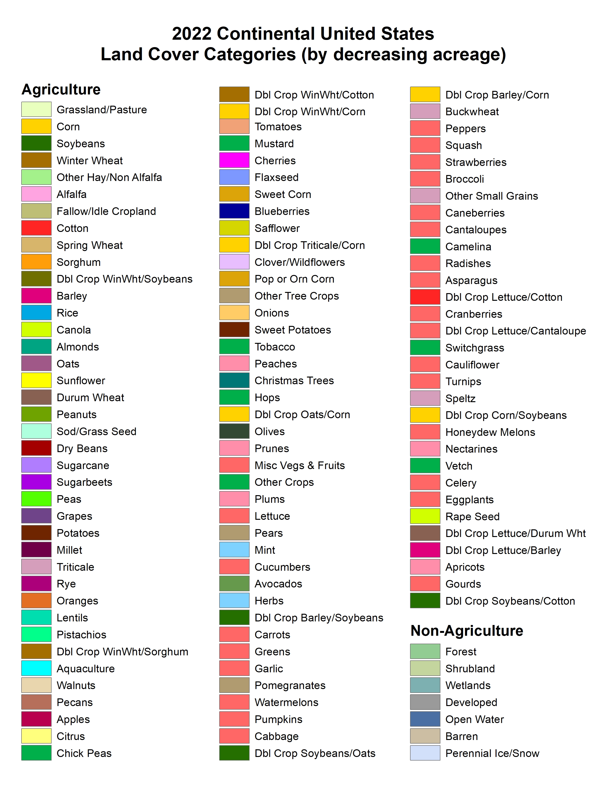

# LatLonCover
This repo creates a function that summarizes land coverage around a location (as defined by one pair of latitude and longitude coordinates)  within the United States.  For example, given location  40.34506167	latitude and -74.72523667 longitude, outcomes from this effort will 1) center a small and large bounding box around the coordinates and 2) use data provided mainly from [CropScape](https://nassgeodata.gmu.edu/CropScape) to report the proportions of areas within the bounding boxes that are designated as Agriculture, Barren, Developed, etc.

This documentation summarizes how to use our function,  the data sources for the function,  and concludes with a detailed descripion of function outputs.

[](https://badge.fury.io/py/latloncover) 
## Usage
The function that summarizes land coverage can be used from multiple ways:
- [Our Website](https://huggingface.co/spaces/imageomics/LatLonCover)
- A command line tool named `latloncover`
- In python code

### Installation
To use the command line `latloncover` tool or the python function requires installing the LatLonCover package.
This can be done by running the following command:
```
pip install latloncover
```

### Command Line Interface
The `latloncover` command line tool reads an input CSV and creates an output CSV with land coverage columns.

Read an input CSV file `input.csv` and write an output CSV file `output.csv` where the latitude and longitude columns are `Lat` and `Lon`:
```
latloncover --lat-col Lat --lon-col Lon input.csv output.csv
```

Help command:
```
latloncover --help
```

### Python API

----

__add_classifications__(*df:pd.DataFrame, lat_col: str, lon_col: str*) -> *pd.DataFrame*

> Returns a new dataframe with *_big and *_small land coverage columns added to df.
    
Parameters:
- __df__ - dataframe with latitude and longitude columns
- __lat_col__ - name of the latitude column in df
- __lon_col__ - name of the longitude column in df

----

### Python Example

The following python code will 
1) read an input CSV file named `input.csv`
2) add new land coverage columns based on the `Lat` and `Lon` columns
3) save the output CSV to `output.csv`
   
```python
import pandas as pd
import latloncover

df = pd.read_csv("input.csv")
df = latloncover.add_classifications(df, lat_col="Lat", lon_col="Lon")
df.to_csv("output.csv", index=False)

```

## Data Sources

### iNaturalist (optional)

Though locations of subjects of intereset can be reported using any software/application, we use locations from the citizen science organism reporting platform called iNaturalist.  Regardless of the applications,  locations need to be reported as latitude and longitude points (decimal degree format).

"iNaturalist is a global community of naturalists, scientists, and members of the public sharing over a million wildlife sightings to teach one another about the natural world while creating high-quality citizen science data for science and conservation". [1]
[iNaturalist API](https://api.inaturalist.org/v1/docs/)

### Cropland Data Layer (CDL)

"The geospatial data product called the Cropland Data Layer (CDL) is hosted on CropScape (https://nassgeodata.gmu.edu/CropScape/). The CDL is a raster, geo-referenced, crop-specific land cover data layer created annually for the continental United States using moderate resolution satellite imagery and extensive agricultural ground truth [2]." All historical CDL products are available for use and free for download through [CropScape](https://nassgeodata.gmu.edu/CropScape/devhelp/help.html).

We are using the web service "GetCDLStat" to supply a csv with the count and acreage of various crop and land use categories.  The inputs we are supplying are year, bounding box, and format which then supplies the a csv file with these data. Bounding boxes use coordinates in the projection of USA Contiguous Albers Equal Area, USGS version [see WSDL](https://nassgeodata.gmu.edu/axis2/services/CDLService?wsdl)

Example:
* `https://nassgeodata.gmu.edu/axis2/services/CDLService/GetCDLStat?year=2018&bbox=130783,2203171,153923,2217961&format=csv`
* supplies csv: `https://nassgeodata.gmu.edu/webservice/nass_data_cache/CDL_2018_clip_20230815110236_390867377.csv`

<pre>
Value, Category, Count,  Acreage
1, Corn, 184246, 40975.3
5, Soybeans, 133819, 29760.6
28, Oats, 338, 75.2
36, Alfalfa, 691, 153.7
37, Other Hay/Non Alfalfa, 449, 99.9
60, Switchgrass, 1, 0.2
61, Fallow/Idle Cropland, 4, 0.9
111, Open Water, 865, 192.4
121, Developed/Open Space, 19409, 4316.5
122, Developed/Low Intensity, 2736, 608.5
123, Developed/Medium Intensity, 743, 165.2
124, Developed/High Intensity, 109, 24.2
131, Barren, 312, 69.4
141, Deciduous Forest, 1418, 315.4
143, Mixed Forest, 3, 0.7
152, Shrubland, 16, 3.6
176, Grass/Pasture, 20899, 4647.8
190, Woody Wetlands, 8297, 1845.2
195, Herbaceous Wetlands, 5748, 1278.3
</pre>

<pre>
Column descriptions:
Value = Identifier for category label
Category = Category Label (see "CrosScape Category Codes" below). Note that category labels are note unique (e.g. Two "Barren" categories with ids 65 and 131).
Count= Count represents a raw pixel count. One pixel corresponds to 30 meters.
Acreage = The acreage for the category (limited to just acreage within the bounding box supplied) at the time point(year) supplied. 
</pre>

"To calculate acreage multiply the count by the square meters conversion factor which is dependent upon the CDL pixel size. The conversion factor for 30 meter pixels is 0.222394."  ([see documentation](https://www.nass.usda.gov/Research_and_Science/Cropland/sarsfaqs2.php#Section2_1.0)).

#### Cropscape CDL category codes

Category codes and names used in CropScape ["List of CDL codes, class names, and RGB color values"](https://www.nass.usda.gov/Research_and_Science/Cropland/docs/CDL_codes_names_colors.xlsx). 

 
* Image source: https://www.nass.usda.gov/Research_and_Science/Cropland/docs/US_2022_CDL_legend.jpg

CDL category definitions: 

"The AGRICULTURAL CATEGORIES are based on data from the Farm Service Agency (FSA) Common Land Unit (CLU) Program. Thus, all crop specific categories are determined by the FSA CLU/578 Program which offers detailed documentation at the following website: https://www.fsa.usda.gov/programs-and-services/laws-and-regulations/handbooks/index. " [4]

"As for the NON-AGRICULTURAL CATEGORIES in the CDL, we sample non-ag training and validation from the USGS National Land Cover Database (NLCD). The NLCD legend with category definitions is available at: https://www.mrlc.gov/data/legends/national-land-cover-database-2016-nlcd2016-legend. In the CDL we have added 100 to their code numbers (i.e. NLCD code 11 "Open Water" is code 111 in the CDL). The NLCD Cultivated Crops category is ignored for CDL purposes. We have also made the decision to merge NLCD "Grassland/Herbaceous" and NLCD "Pasture/Hay" into a single CDL category called "Grassland/Pasture" (CDL code 176)." [4]

#### Combined Category Codes
For the purpose of this effort, every CropScape category was assigned to *one* combined "fineClass" and "courseClass" category. "CDL SubGroup Categories" [CDL_subcategories.csv](cropScapeDocumentation/CDL_subcategories.csv).  
Column descriptions:
* Codes = The CDL category identifier
* Class_Names = CDL category name
* courseClass = Code for group of CDL categories focused on grouping into 7 course scale categories. For example all crops were grouped into "A" indicating Agriculture. [Course subcategory code definitions](cropScapeDocumentation/CDL_subcategories_legendCrse.csv)
* fineClass = Code for group of CDL categories focused on grouping into 18 fine scale categories. For example, forest course category was broken into finer classes such as "FD" Forest Deciduous and "FE" Forest Evergreen. [Fine subcategory code definitions](cropScapeDocumentation/CDL_subcategories_legendFine.csv)

## Outcomes for this effort
Outcomes from this repository reports proportions of areas within small and large bounding boxes that are designated as Agriculture, Barren, Developed, etc.

* Refer to [CDL_subcategories.csv](cropScapeDocumentation/CDL_subcategories.csv) to learn exactly how cropscape CDL codes were grouped to create 8 course "subcategories".
* Refer to  [Course subcategory code definitions](cropScapeDocumentation/CDL_subcategories_legendCrse.csv) to list the 8 groups.
* Refer to the [Data dictionary](outputDataDictionary.txt) to list the variables created for provided lat-lon locations.  


	
### References

[1] iNatualist API.(n.d.). https://api.inaturalist.org/v1/docs/ 

[2] Boryan, Claire, Zhengwei Yang, Rick Mueller, and Mike Craig. 2011. Monitoring US Agriculture: The US Department of Agriculture, National Agricultural Statistics Service, Cropland Data Layer Program. Geocarto International 26 (5): 341–58. https://doi.org/10.1080/10106049.2011.562309.

[3] USDA National Agricultural Statistics Service Cropland Data Layer. 2022. Published crop-specific data layer [Online]. USDA-NASS, Washington, DC. Available at https://nassgeodata.gmu.edu/CropScape/. 

[4] United States Department of Agriculture. USDA. (n.d.). Section 2: CropScape Technical Information. https://www.nass.usda.gov/Research_and_Science/Cropland/sarsfaqs2.php#Section2_1.0
